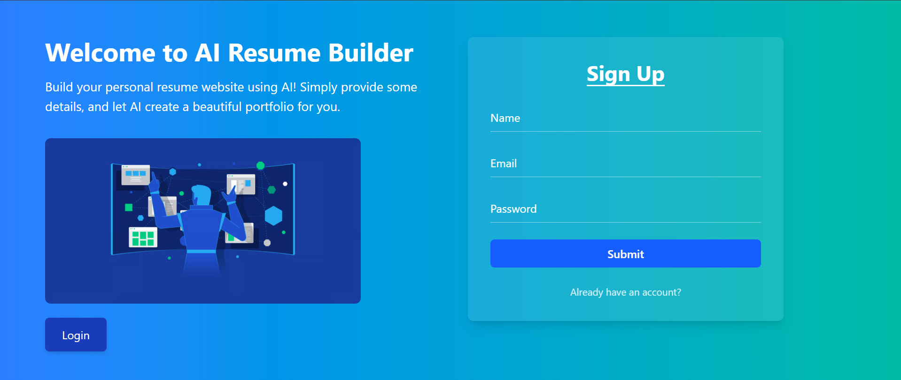
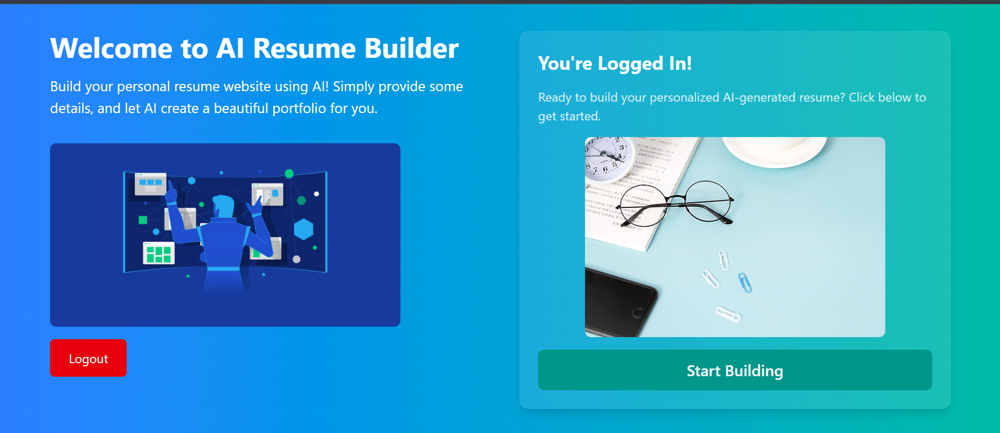
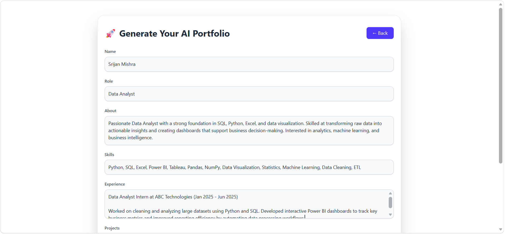

# 🚀 AI Portfolio Generator

An AI-powered portfolio generator built using the **MERN Stack** and **Google Gemini API**. This application allows users to generate professional, recruiter-friendly portfolio content in Markdown format by simply filling out a form with their personal and professional details.

## 🌟 Features

* 🔐 User Authentication with JWT
* 🤖 AI-Powered Portfolio Generation using Gemini API
* 📝 Generates Professional Markdown Portfolios
* 💾 Stores Generated Portfolios in MongoDB
* 🎨 Responsive and Modern UI
* ⚡ Fast Frontend Powered by Vite
* 📱 Mobile-Friendly Design
* 👤 User Registration and Login System
* 📄 Portfolio Preview Before Use

---

## 🛠️ Tech Stack

### Frontend

* React.js
* Vite
* Tailwind CSS
* React Router DOM
* Axios

### Backend

* Node.js
* Express.js
* MongoDB
* Mongoose
* JWT Authentication
* Google Gemini API

---

## 📂 Project Structure

```text
AI-Portfolio-Generator/
│
├── backend/
│   ├── config/
│   │   ├── apiConfig.js
│   │   └── dbConfig.js
│   │
│   ├── controllers/
│   │   ├── portfolioController.js
│   │   └── userController.js
│   │
│   ├── middleware/
│   │   └── authMiddleware.js
│   │
│   ├── models/
│   │   ├── Portfolio.js
│   │   └── Users.js
│   │
│   ├── routes/
│   │   ├── portfolioRoutes.js
│   │   ├── userRoutes.js
│   │   └── middlewareRoute.js
│   │
│   ├── .env
│   ├── index.js
│   └── package.json
│
├── frontend/
│   ├── public/
│   │
│   ├── src/
│   │   ├── assets/
│   │   ├── AuthContext/
│   │   ├── components/
│   │   ├── Pages/
│   │   ├── App.jsx
│   │   ├── main.jsx
│   │   └── index.css
│   │
│   ├── index.html
│   ├── vite.config.js
│   └── package.json
│
├── screenshots/
│   ├── home-page.png
│   ├── login-page.png
│   ├── portfolio-form.png
│   └── generated-portfolio.png
│
├── README.md
└── .gitignore
```

---

## 📸 Application Screenshots

### 🏠 Home Page



### 🔐 Login Page



### 📝 Portfolio Form



### 📄 Generated Portfolio


---

## ⚙️ Environment Variables

Create a `.env` file inside the backend folder.

```env
PORT=5001

MONGODB_URI=your_mongodb_connection_string

JWT_SECRET=your_jwt_secret

GEMINI_API_KEY=your_gemini_api_key
```

---

## 🚀 Installation & Setup

### Clone the Repository

```bash
git clone https://github.com/srijankishu/Resume_Builder.git
```

### Backend Setup

```bash
cd backend
npm install
npm run dev
```

### Frontend Setup

```bash
cd frontend
npm install
npm run dev
```

---

## 💻 Usage

1. Register or Login.
2. Fill in your portfolio details.
3. Click **Generate Portfolio**.
4. The application sends the information to Gemini AI.
5. AI generates a professional portfolio in Markdown format.
6. Portfolio is stored in MongoDB for future reference.

---

## 📡 API Endpoint

### Generate Portfolio

```http
POST /api/portfolio/generate
```

### Sample Request

```json
{
  "name": "John Doe",
  "role": "Full Stack Developer",
  "about": "Passionate developer with expertise in MERN stack.",
  "skills": ["React", "Node.js", "MongoDB"],
  "experience": "Frontend Developer Intern",
  "projects": "AI Portfolio Generator",
  "links": ["https://github.com/johndoe"]
}
```

---

## 🎯 Future Enhancements

* Export Portfolio as PDF
* Multiple Portfolio Templates
* Dark/Light Theme Toggle
* Portfolio Hosting
* Resume Upload & Parsing
* AI Resume Improvement Suggestions
* Portfolio Sharing via Public Link

---

## 👨‍💻 Author

**Srijan Mishra**

* GitHub: https://github.com/srijankishu/Resume_Builder.git

---

## ⭐ Support

If you found this project useful, consider giving it a ⭐ on GitHub.

---


